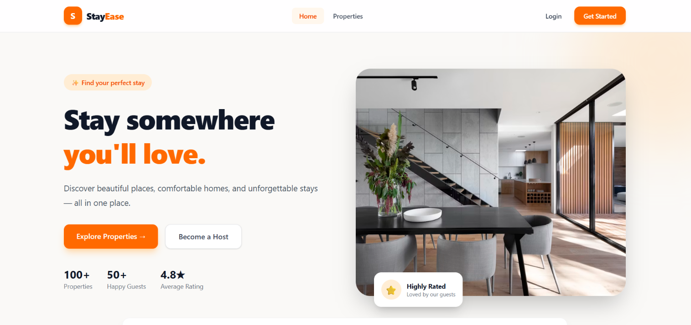
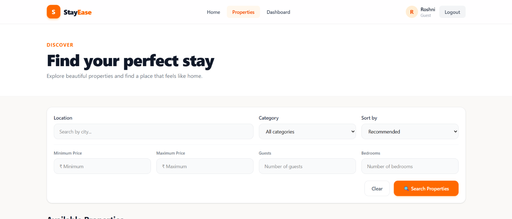
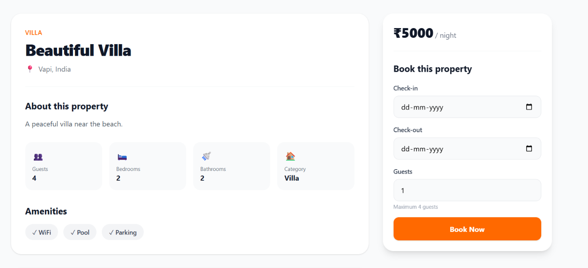
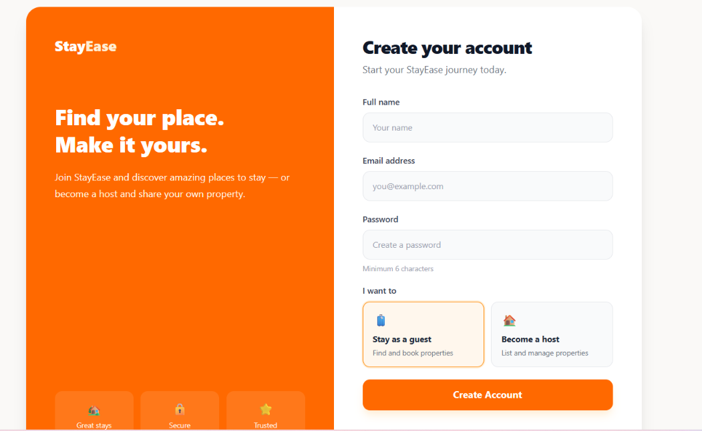
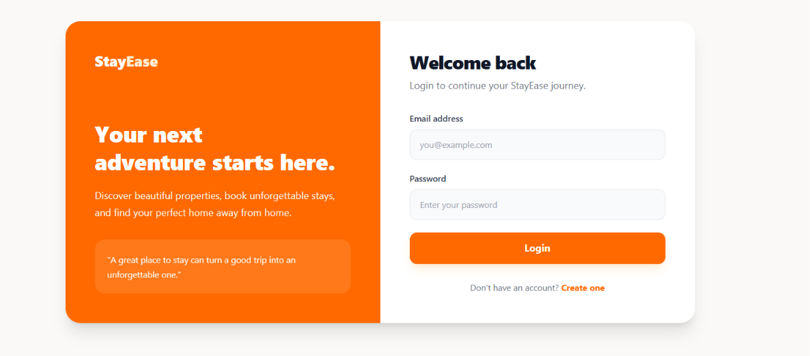
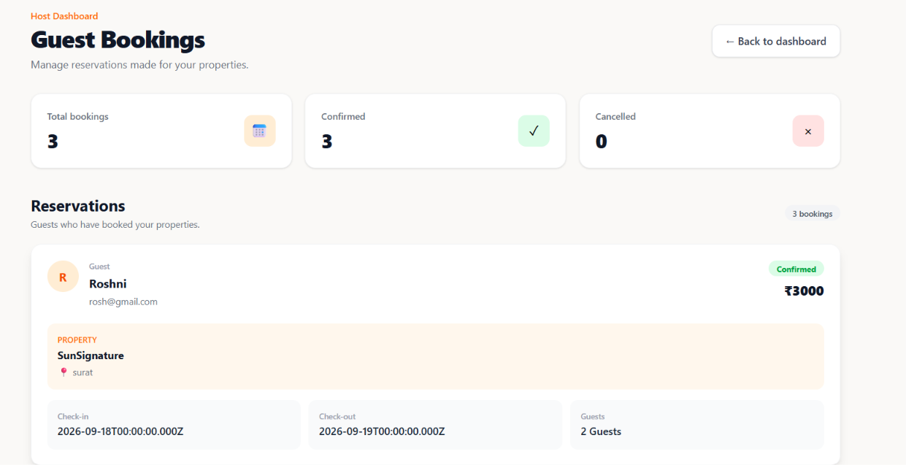
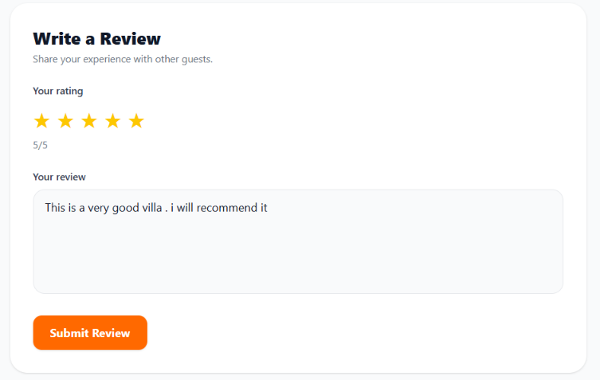

# 🏡 StayEase

A full-stack property booking platform built with the **MERN stack**, designed to let guests discover and book properties while allowing hosts to list and manage their properties.

🌐 **Live Demo:** https://stay-ease-steel.vercel.app/  
💻 **GitHub:** https://github.com/Rahul-Vishwakarma17/stay-ease

---

## 📸 Screenshots

### 🏠 Home Page


### 🔍 Property Search & Filtering


### 🏡 Property Details & Booking


### 📝 User Registration


### 🔐 User Login


### 📋 Host Booking Management


### ⭐ Reviews & Ratings


---

## ✨ Features

### 👤 Authentication & Roles
- User registration and login
- JWT-based authentication
- Guest and host roles
- Role-aware application flow

### 🏠 Property Management
- Browse available properties
- Add properties as a host
- Edit property information
- Property details with amenities, guests, bedrooms and bathrooms
- Image upload support using Cloudinary

### 🔍 Search & Filtering
- Search properties by location
- Filter by category
- Filter by minimum and maximum price
- Filter by number of guests
- Filter by bedrooms
- Sort property results

### 📅 Booking System
- Select check-in and check-out dates
- Select number of guests
- Create property bookings
- View booking information
- Host-side booking management
- Booking status tracking

### ⭐ Reviews
- Submit property ratings
- Write reviews
- Display guest feedback

### 📊 Dashboards
- Guest dashboard
- Host dashboard
- Host booking management

---

## 🛠️ Tech Stack

### Frontend
- React
- Vite
- React Router
- Axios
- Tailwind CSS
- Lucide React

### Backend
- Node.js
- Express.js
- MongoDB
- Mongoose
- JWT
- bcryptjs
- Multer
- Cloudinary
- CORS
- dotenv

### Deployment
- Frontend: Vercel
- Backend: Render
- Database: MongoDB Atlas
- Image Storage: Cloudinary

---

## 🏗️ Project Architecture

StayEase follows a separate frontend/backend architecture:

```text
StayEase
├── frontend/
│   ├── public/
│   └── src/
│       ├── components/
│       ├── context/
│       ├── pages/
│       ├── routes/
│       ├── services/
│       └── App.jsx
│
└── backend/
    └── src/
        ├── config/
        ├── controllers/
        ├── middleware/
        ├── models/
        ├── routes/
        ├── services/
        ├── app.js
        └── server.js
```

---

## 🗂️ Main Data Models

- **User** — authentication, user details and role
- **Property** — property information, pricing, amenities and host
- **Booking** — guest reservations and booking details
- **Review** — ratings and guest reviews

---

## ⚙️ Local Setup

### Prerequisites

Make sure you have installed:

- Node.js
- MongoDB / MongoDB Atlas
- Git

### 1. Clone the repository

```bash
git clone https://github.com/Rahul-Vishwakarma17/stay-ease.git
cd stay-ease
```

### 2. Backend Setup

```bash
cd backend
npm install
npm run dev
```

The backend runs using the server configuration in `src/server.js`.

### 3. Frontend Setup

Open another terminal:

```bash
cd frontend
npm install
npm run dev
```

The frontend uses Vite for development.

---

## 🔐 Environment Variables

Create the required `.env` files locally.

### Backend

Typical backend configuration includes:

```env
PORT=5000
MONGODB_URI=your_mongodb_connection_string
JWT_SECRET=your_jwt_secret
CLOUDINARY_CLOUD_NAME=your_cloudinary_cloud_name
CLOUDINARY_API_KEY=your_cloudinary_api_key
CLOUDINARY_API_SECRET=your_cloudinary_api_secret
```

### Frontend

Configure the frontend API base URL according to your local backend/deployment setup.

> **Never commit real API keys, database credentials, JWT secrets or other sensitive values to GitHub.**

---

## 🚀 Deployment

The application is deployed as separate frontend and backend services:

- **Frontend:** Vercel
- **Backend:** Render
- **Database:** MongoDB Atlas
- **Media storage:** Cloudinary

The live frontend is available at:

https://stay-ease-steel.vercel.app/

---

## 🎯 Key Learning Outcomes

Through StayEase, the project covers practical full-stack development concepts including:

- REST API development
- React component-based architecture
- Client-server communication with Axios
- JWT authentication and authorization
- Role-based access control
- MongoDB schema design with Mongoose
- CRUD operations
- Image upload and cloud storage
- Booking workflow
- Search and filtering
- Deployment of frontend and backend services

---

## 🔮 Future Improvements

Possible future enhancements include:

- Online payment integration
- Email notifications for bookings
- Improved availability conflict handling
- Advanced host analytics
- Better mobile responsiveness
- Automated testing
- Dockerized deployment

---

## 👨‍💻 Author

**Rahul Vishwakarma**

- GitHub: https://github.com/Rahul-Vishwakarma17
- Portfolio: https://portfolio-sable-gamma-8lm4286ch3.vercel.app/
- LinkedIn: https://www.linkedin.com/in/rahul-vishwakarma-118675374/

---

⭐ If you found this project useful, consider giving the repository a star!
